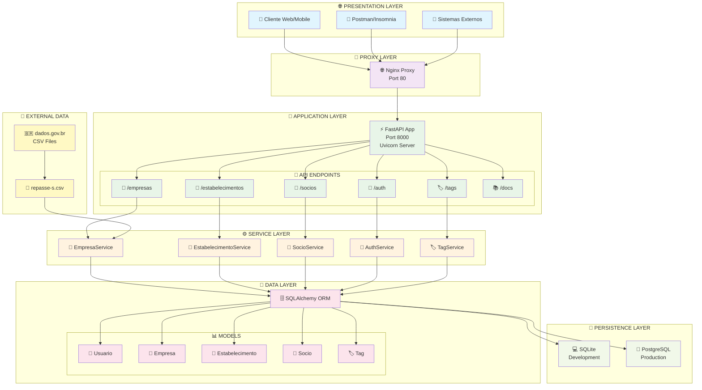
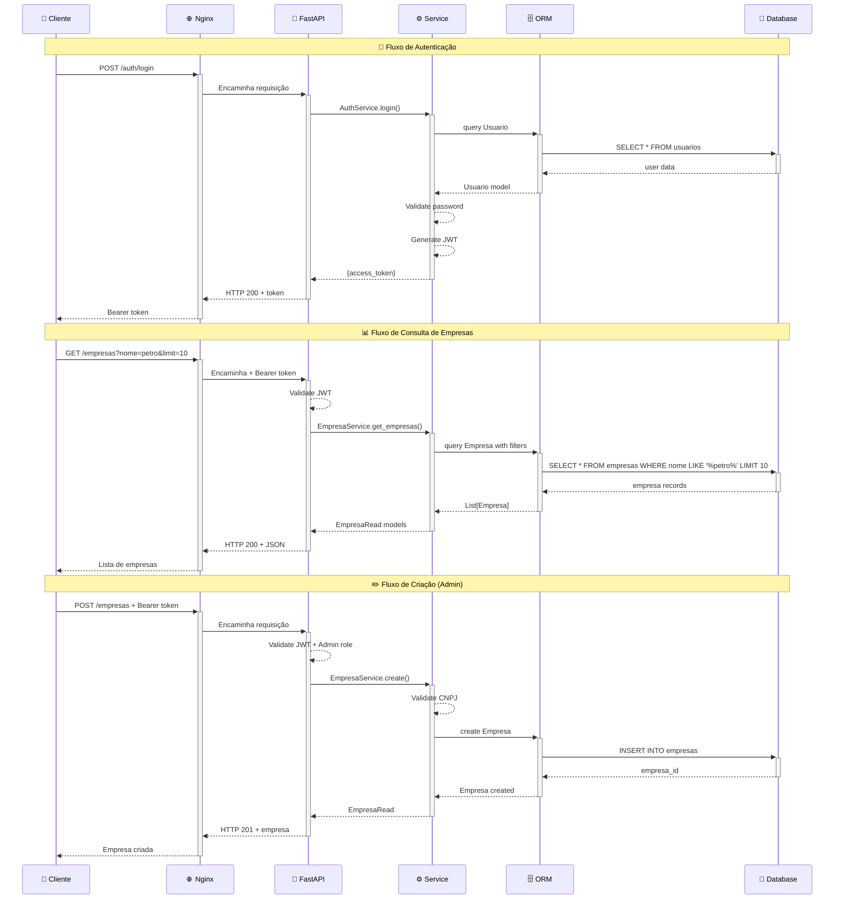
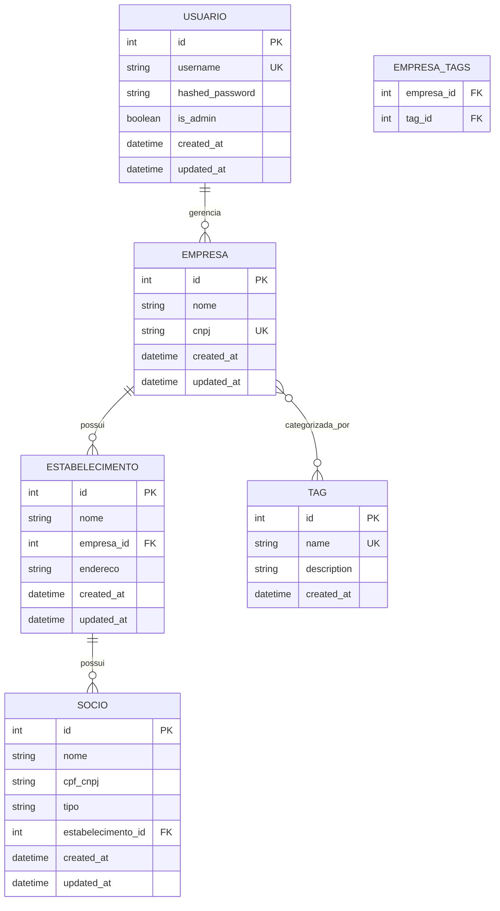
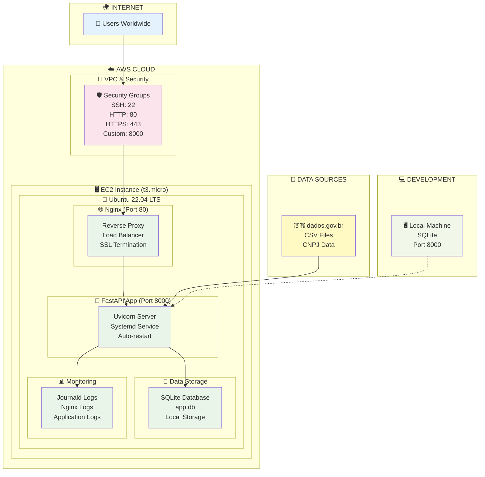
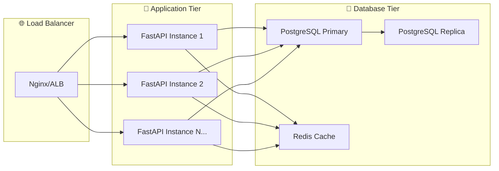

# 🏗️ Arquitetura do Sistema - API Cadastro CNPJ

## 📊 Visão Geral da Arquitetura



## 🔄 Fluxo de Dados Detalhado



## 🏗️ Padrões Arquiteturais Implementados

### 🔄 **Layered Architecture**
```
┌─────────────────────────────────┐
│    🌐 PRESENTATION LAYER        │  ← FastAPI Routers
│    (HTTP Endpoints)             │    REST API, Swagger UI
├─────────────────────────────────┤
│    ⚙️ SERVICE LAYER             │  ← Business Logic  
│    (Business Rules)             │    Validation, Processing
├─────────────────────────────────┤
│    💾 DATA LAYER                │  ← SQLAlchemy Models
│    (Domain Models)              │    ORM, Relationships
├─────────────────────────────────┤
│    💽 PERSISTENCE LAYER         │  ← Database Access
│    (Data Storage)               │    SQLite, PostgreSQL
└─────────────────────────────────┘
```

### 🎯 **Dependency Injection Pattern**
```python
# Injeção de Dependências
@router.get("/")
def get_empresas(
    db: Session = Depends(get_db),           # Database session
    current_user: User = Depends(get_current_user),  # Authentication
    skip: int = 0,
    limit: int = 10
):
    return EmpresaService.get_empresas(db, skip, limit)
```

### 🔒 **Middleware Pattern**
```python
# Chain of Responsibility para autenticação
Request → CORS → JWT Validation → Role Authorization → Endpoint
```

## 🗄️ Modelo de Dados Relacional



## 🌐 Deployment Architecture (AWS EC2)



## 📈 Escalabilidade e Performance

### 🔄 **Horizontal Scaling Strategy**


### ⚡ **Performance Optimizations**
- **Connection Pooling**: SQLAlchemy pool configurado
- **Query Optimization**: Índices em campos frequentes
- **Pagination**: Limit/Offset para grandes datasets  
- **Lazy Loading**: Relacionamentos carregados sob demanda
- **Response Compression**: Gzip automático no Nginx
- **Static Asset Caching**: Headers de cache configurados

---

**Arquitetura projetada por:** Eliel Guedes  
**Data:** 18 de Outubro de 2025  
**Versão:** 1.0.0  
**Status:** ✅ Produção Ativa