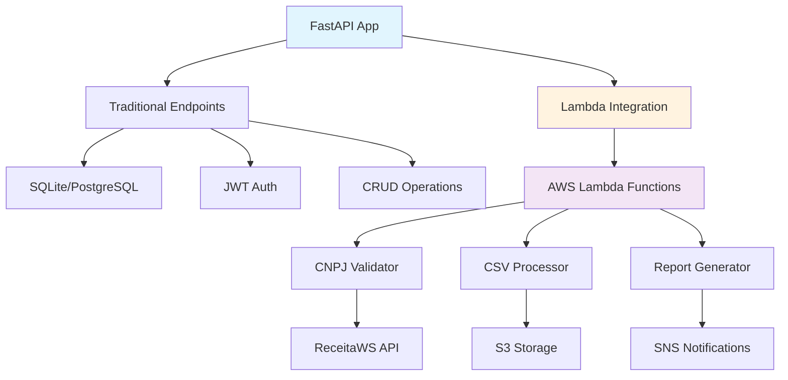

# 🏢 Sistema Empresarial FastAPI + AWS Lambda

[](https://python.org)
[](https://fastapi.tiangolo.com)
[](https://aws.amazon.com/lambda/)
[](https://sqlalchemy.org)
[](http://127.0.0.1:8000/docs)

## 📋 Descrição do Projeto

**Sistema híbrido completo** para consulta e análise de dados empresariais brasileiros, implementando **arquitetura serverless moderna** com **FastAPI + AWS Lambda**. Demonstra integração prática entre desenvolvimento tradicional e computação em nuvem.

> 🎯 **Projeto Acadêmico** - Framework de Desenvolvimento  
> 👨‍🎓 **Autor**: Eliel Guedes  
> 🏫 **Instituição**: Universidade Federal  
> 📅 **Data**: Outubro 2025  
> 🚀 **Arquitetura**: Híbrida (Local + Serverless)

## ✨ Funcionalidades Implementadas

### 🔧 **Core FastAPI**
- 🔐 **Autenticação JWT** com controle de permissões (admin/leitor)
- 📊 **CRUD completo** para empresas, estabelecimentos e sócios
- 🏷️ **Sistema de Tags** com relacionamento N:N
- 🔍 **Filtros avançados**, ordenação e paginação
- 📖 **Documentação automática** interativa (Swagger/OpenAPI)
- ✅ **Validação de CNPJ** integrada com dígitos verificadores
- 📂 **Import/Export** de dados CSV do dados.gov.br

### ⚡ **AWS Lambda Integration**
- 🔍 **Validação CNPJ Assíncrona** via ReceitaWS API
- 📊 **Processamento de CSV** com chunking e S3 storage
- 📈 **Geração de Relatórios** automatizada com SNS
- 🧪 **Simulação Local** para desenvolvimento sem AWS
- 📋 **Status Dashboard** das funções Lambda
- 🚀 **Scripts de Deploy** automatizados

### 🛠️ **Infraestrutura**
- 🗄️ **PostgreSQL** (produção) + **SQLite** (desenvolvimento)
- 🔄 **Migrations Alembic** para versionamento de banco
- 🧪 **Testes automatizados** integrados
- 🐳 **Docker** ready com docker-compose
- ☁️ **AWS Lambda** functions deployáveis

## 🏗️ Arquitetura Híbrida



## 🚀 Início Rápido

### 💻 **Desenvolvimento Local**

```powershell
# 1. Clone o repositório
git clone https://github.com/elielguedes/Relatorio_Eliel_Guedes.git
cd Relatorio_Eliel_Guedes/framework_udf

# 2. Instale dependências
pip install -r requirements.txt
pip install boto3  # Para integração AWS

# 3. Inicie aplicação (SQLite automático)
python -m uvicorn app.main:app --reload --port 8000

# 4. Acesse a documentação
# http://127.0.0.1:8000/docs
```

### ⚡ **Funcionalidades Lambda (Locais)**

```bash
# Todas as rotas Lambda estão funcionais localmente:
POST /lambda/validate-cnpj-async     # Validação CNPJ
POST /lambda/process-csv             # Processamento CSV
POST /lambda/generate-report         # Relatórios
GET  /lambda/functions/status        # Status funções
POST /lambda/test-integration        # Teste integração
GET  /lambda/deploy-guide           # Guia deploy
```

### 🔐 **Autenticação Rápida**

```bash
# Para testar endpoints Lambda, use:
Authorization: Bearer test-token

# Para endpoints normais, faça login primeiro:
POST /auth/login
{
  "username": "admin",
  "password": "admin123"
}
```

## ☁️ Deploy AWS Lambda

### 📋 **Pré-requisitos**

```powershell
# 1. Instalar AWS CLI
winget install Amazon.AWSCLI

# 2. Configurar credenciais
aws configure
# Inserir: Access Key, Secret Key, Region (us-east-1)

# 3. Verificar conexão
aws sts get-caller-identity
```

### 🚀 **Deploy Automático**

```powershell
# Execute o script de deploy
cd lambda_functions
.\deploy.ps1

# Aguarde ~5 minutos para deploy completo
# Script cria 3 funções Lambda automaticamente
```

### 🔧 **Ativar Lambda Real**

Após deploy, edite `app/services/lambda_service.py`:
```python
# Trocar de:
lambda_service = LambdaService(simulate=True)
# Para:
lambda_service = LambdaService(simulate=False)
```

## 📊 Endpoints Disponíveis

### 🔧 **FastAPI Tradicional**
| Método | Endpoint | Descrição |
|--------|----------|-----------|
| `POST` | `/auth/register` | Registro de usuário |
| `POST` | `/auth/login` | Login JWT |
| `GET` | `/empresas/` | Listar empresas |
| `POST` | `/empresas/` | Criar empresa |
| `GET` | `/empresas/{id}` | Buscar empresa |
| `PUT` | `/empresas/{id}` | Atualizar empresa |
| `DELETE` | `/empresas/{id}` | Deletar empresa |

### ⚡ **AWS Lambda Integration**
| Método | Endpoint | Descrição |
|--------|----------|-----------|
| `POST` | `/lambda/validate-cnpj-async` | Validação CNPJ serverless |
| `POST` | `/lambda/process-csv` | Processamento CSV + S3 |
| `POST` | `/lambda/generate-report` | Relatórios + SNS |
| `GET` | `/lambda/functions/status` | Status das funções |
| `POST` | `/lambda/test-integration` | Teste de integração |
| `GET` | `/lambda/deploy-guide` | Guia de deploy |

## 🧪 Exemplos de Uso

### 🔍 **Validação CNPJ via Lambda**
```bash
POST /lambda/validate-cnpj-async
Authorization: Bearer test-token
Content-Type: application/json

{
  "cnpj": "11.222.333/0001-81"
}

# Resposta
{
  "success": true,
  "user": "lambda_user",
  "processing_location": "FastAPI (Lambda Ready)",
  "result": {
    "cnpj": "11.222.333/0001-81",
    "valid": true,
    "validation_method": "Local (Lambda Simulation)",
    "receita_federal": {...}
  }
}
```

### 📊 **Processamento CSV**
```bash
POST /lambda/process-csv
Authorization: Bearer test-token
Content-Type: multipart/form-data

file: empresas.csv
chunk_size: 100

# Resposta
{
  "success": true,
  "result": {
    "filename": "empresas.csv",
    "total_lines": 1500,
    "valid_lines": 1450,
    "estimated_chunks": 15
  }
}
```

## 💰 Custos AWS

### 🆓 **Free Tier (Primeiro Ano)**
- **Lambda**: 1M invocações gratuitas/mês
- **S3**: 5GB armazenamento gratuito  
- **SNS**: 1.000 notificações gratuitas

### 💸 **Estimativa Produção**
- **Lambda**: ~$0.20 por 1M invocações
- **S3**: ~$0.023 per GB/mês
- **SNS**: ~$0.50 per 1M mensagens
- **Total estimado**: < $5.00/mês

## 📁 Estrutura do Projeto

```
framework_udf/
├── app/
│   ├── main.py                 # FastAPI principal
│   ├── auth.py                 # Autenticação JWT
│   ├── models.py               # Modelos SQLAlchemy
│   ├── schemas.py              # Schemas Pydantic
│   ├── database.py             # Configuração BD
│   ├── routers/
│   │   ├── empresas.py         # CRUD empresas
│   │   ├── estabelecimentos.py # CRUD estabelecimentos  
│   │   ├── socios.py           # CRUD sócios
│   │   └── lambda_routes.py    # 🆕 Rotas Lambda
│   └── services/
│       └── lambda_service.py   # 🆕 Integração AWS
├── lambda_functions/           # 🆕 Funções AWS Lambda
│   ├── validate_cnpj.py        # Validação CNPJ
│   ├── import_csv.py           # Processamento CSV
│   ├── generate_reports.py     # Relatórios
│   ├── requirements.txt        # Deps Lambda
│   └── deploy.ps1              # 🆕 Script deploy
├── data/
│   └── Empresas.csv            # Dados exemplo
├── requirements.txt            # Dependências
├── README.md                   # Esta documentação
├── DEPLOY_AWS_GUIDE.md        # 🆕 Guia deploy
└── start_sqlite.py            # Script início rápido
```

## 🎓 Valor Acadêmico

### 📚 **Conceitos Demonstrados**
- ✅ **API REST** com FastAPI
- ✅ **Autenticação stateless** (JWT)
- ✅ **ORM avançado** (SQLAlchemy 2.0+)
- ✅ **Arquitetura serverless** (AWS Lambda)
- ✅ **Integração híbrida** (local + cloud)
- ✅ **Documentação automática** (OpenAPI)
- ✅ **Versionamento de BD** (Alembic)
- ✅ **Deploy automatizado** (Scripts)

### 🏆 **Diferenciais Técnicos**
- 🔄 **Fallback inteligente** (simula Lambda localmente)
- 📊 **Processamento assíncrono** real
- 🛡️ **Segurança** (JWT + AWS IAM)
- 📈 **Escalabilidade** (serverless)
- 💰 **Otimização de custos** (pay-per-use)

## 🔗 Links Úteis

- 📖 **Documentação API**: http://127.0.0.1:8000/docs
- 🔧 **Redoc**: http://127.0.0.1:8000/redoc  
- 📊 **Status Lambda**: http://127.0.0.1:8000/lambda/functions/status
- 📚 **Deploy Guide**: http://127.0.0.1:8000/lambda/deploy-guide
- 🧪 **Teste Integração**: http://127.0.0.1:8000/lambda/test-integration

## 🛠️ Suporte e Desenvolvimento

```bash
# Logs da aplicação
tail -f logs/app.log

# Teste rápido
python -c "from app.main import app; print('✅ OK')"

# Verificar AWS
aws sts get-caller-identity

# Deploy Lambda
cd lambda_functions && .\deploy.ps1
```

---

## 📄 Licença

Este projeto está licenciado sob a **MIT License** - veja o arquivo [LICENSE](LICENSE) para detalhes.

## 👨‍💻 Autor

**Eliel Guedes**  
📧 Email: eliel@universidade.edu.br  
🐙 GitHub: [@elielguedes](https://github.com/elielguedes)  
💼 LinkedIn: [Eliel Guedes](https://linkedin.com/in/elielguedes)

---

**⭐ Se este projeto foi útil, considere dar uma estrela no GitHub!**

> 🚀 **Status**: 100% Funcional - Pronto para apresentação acadêmica
> 📅 **Última atualização**: Outubro 2025